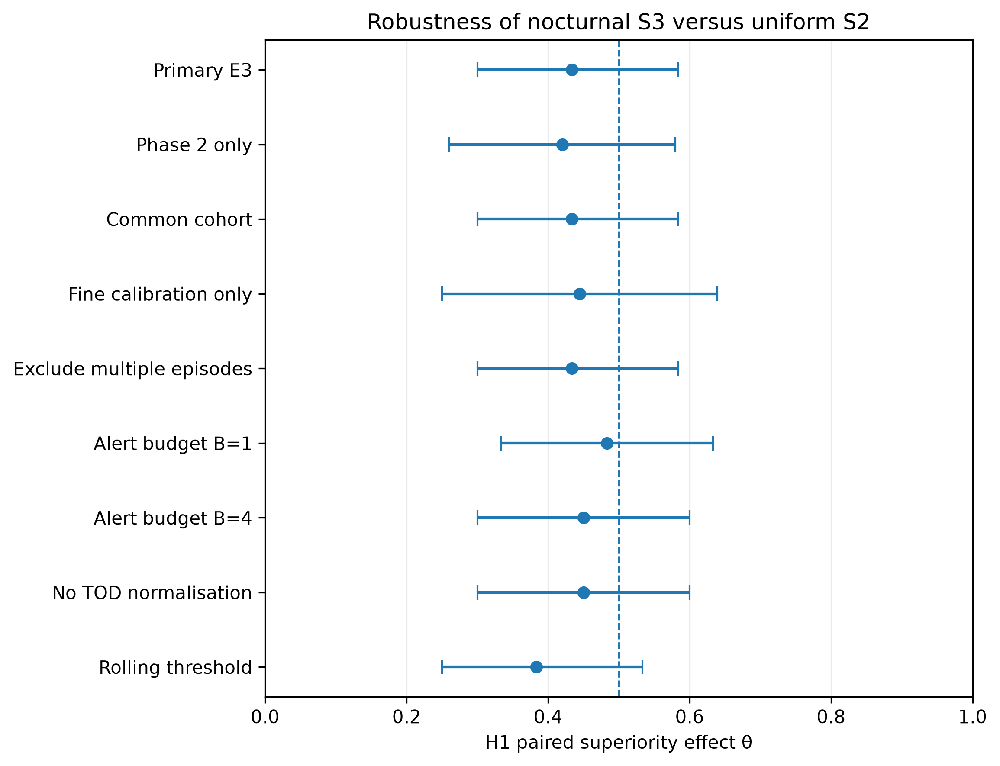

# Results and limitations

*Initial version, 17 September 2026; updated 24 and 25 September 2026. Values are transcribed from the archived output of the corrected primary run I executed, now published in [`results/primary_e3_run_83cc8d1/`](../results/primary_e3_run_83cc8d1/). On 24 September 2026 I checked every value against those files, recomputed θ and each exact p-value from the published counts, and regenerated the tables, digest and figures from the published summary files; the [results note](../results/README.md) and the [verification log](../evidence/VERIFICATION_LOG.md) give the details. On 25 September 2026 the BCa intervals were also recomputed from the published counts and matched; see the [verification report](VERIFICATION_REPORT.md). The analysis itself has not been re-run on the source data.*

## Primary result (confirmatory)

H1 compared fixed-clock nighttime sampling (S3: seven ten-minute bursts from 00:00 to 06:59) with evenly spaced sampling (S2: seven ten-minute bursts every 205 minutes from 00:00) at the primary modelled energy budget (E3, central energy parameters), with an alert budget of at most two alert-days per person-month.

| Quantity | S3 nighttime | S2 evenly spaced |
|---|---|---|
| Participants with a presymptomatic alert | 19/30 (63.3%) | 20/30 (66.7%) |
| Median warning among those alerted, days (IQR) | 13.0 (9.0–19.5) | 14.0 (8.2–19.0) |

Paired comparison: 8 wins, 12 losses, and 10 ties for S3; θ = 0.433 (95% BCa bootstrap interval 0.300–0.583, 10,000 resamples); exact two-sided sign test p = 0.5034; N = 30.

θ = (wins + 0.5 × ties) / paired N. A participant counts as a win for schedule A if A alerted in the presymptomatic window (21 days before onset to the day before onset) and B did not, or if both alerted and A's warning was strictly longer. The sign test uses the 20 discordant pairs. θ is a paired comparison statistic, not an accuracy percentage.

**H1 was not rejected, so the fixed testing sequence (H1, then M1, then H2 and H3) closed.** The archived [gatekeeping record](../results/primary_e3_run_83cc8d1/confirmatory_analysis/gatekeeping_decisions.json) marks M1, H2, and H3 as not confirmatorily tested. The full values are in the [confirmatory summary](../results/primary_e3_run_83cc8d1/confirmatory_analysis/confirmatory_comparison_summary.csv) and the [results table](../results/primary_e3_run_83cc8d1/final_tables_figures/table_primary_confirmatory_results.csv).

*Archived figure from the corrected run. Points are θ; bars are 95% BCa intervals; the dashed line is θ = 0.5, no difference. Values below 0.5 favour the second schedule named. Only H1 is a confirmatory test.*

## Estimation-only contrasts

| Comparison | A vs B | W/L/T (A) | θ (95% BCa) | Unadjusted exact p* | A alerted | B alerted | Median warning A / B, days |
|---|---|---|---|---|---|---|---|
| M1 | S3r vs S6 | 13/11/6 | 0.533 (0.367–0.683) | 0.8388 | 23/30 | 19/30 | 13.0 / 9.0 |
| H2 | S3 vs S5 | 10/10/10 | 0.500 (0.350–0.650) | 1.0000 | 19/30 | 19/30 | 13.0 / 14.0 |
| H3 | S3 vs S4 | 2/9/19 | 0.383 (0.283–0.483) | 0.0654 | 19/30 | 22/30 | 13.0 / 15.5 |

\* Reported in the archived table for description only. These are not tests of the hypotheses because the sequence closed after H1, and they are not adjusted for multiple comparisons. S3r and S6 select rest periods using a whole day's step data, so M1 describes a counterfactual, not a deployable schedule.

## Sensitivity analyses (after the primary result, estimation-only)

These were operationalised in amendment [A7](prereg-v1.2-amendment-A7-sensitivity-operationalization.md) after the primary result was known. They cannot reopen the testing sequence, and no sensitivity p-value was computed. The complete table covers all four comparisons: [`sensitivity_summary.csv`](../results/primary_e3_run_83cc8d1/sensitivity_analysis/sensitivity_summary.csv).

For H1:

| Variation | N | W/L/T | θ (95% BCa) |
|---|---|---|---|
| Primary E3 | 30 | 8/12/10 | 0.433 (0.300–0.583) |
| Phase 2 participants only | 25 | 7/11/7 | 0.420 (0.260–0.580) |
| Common cohort across all primary arms | 30 | 8/12/10 | 0.433 (0.300–0.583) |
| Participants with fine calibration resolution only | 18 | 5/7/6 | 0.444 (0.250–0.639) |
| Excluding participants with more than one onset row | 30 | 8/12/10 | 0.433 (0.300–0.583) |
| Alert budget 1 per person-month | 30 | 9/10/11 | 0.483 (0.333–0.633) |
| Alert budget 4 per person-month | 30 | 9/12/9 | 0.450 (0.300–0.600) |
| Detector without time-of-day normalisation | 30 | 9/12/9 | 0.450 (0.300–0.600) |
| Rolling threshold recalibration | 30 | 6/13/11 | 0.383 (0.250–0.533) |

No H1 estimate rose above 0.5, and every interval includes 0.5. That describes how the estimate moved under these particular variations. It does not turn the non-rejection into evidence that the schedules perform equally.

Two variations tested nothing new in this cohort. The common-cohort and multiple-episode analyses gave exactly the primary counts in all four comparisons with the same number of participants, so no evaluable participant was removed: all 30 were already evaluable in every arm. A7 specifies that the multiple-episode check is reported as vacuous if no cohort participant has more than one onset row, and the identical result is consistent with that; the onset rows themselves are withheld. The M1 analysis matched on delivered heart-rate minutes is a genuine re-analysis that happened to give the same totals, 13/11/6. Identical totals do not by themselves show that every pair resolved the same way, and its upper interval limit differs slightly (0.700 against 0.683); it also used a different bootstrap seed.

One contrast does move. H3 favours rest-triggered S4 in the primary analysis, θ = 0.383 (0.283–0.483), and under the lower alert budget it becomes 0.517 (0.417–0.617). H3 is estimation-only, and this is reported as found.

*Archived figure. The M1 counterpart is [`figure_m1_sensitivity.png`](../results/primary_e3_run_83cc8d1/final_tables_figures/figure_m1_sensitivity.png).*

The archived [results digest](../results/primary_e3_run_83cc8d1/final_tables_figures/final_results_digest.txt), written when the tables were produced, calls the primary null finding robust to these analyses. The more careful reading is the one above: the estimates stayed at or below 0.5, the intervals stayed wide, and two of the checks were vacuous here.

## From 38 to 30 participants

- The source-defined cohort contained 38 participants: 10 from Phase 1 and 28 from Phase 2.
- A pair of schedules was compared for a participant only if both schedules gave at least 16 z-defined calibration days and an evaluable presymptomatic window; otherwise the pair was marked unavailable rather than scored.
- The calibration floor was met by 32 of 38 participants for S1, S2, S4, and S5, and by 30 of 38 for S3, S3r, and S6.
- The same 8 participants (5 from Phase 1 and 3 from Phase 2) lacked an evaluable pair in all four comparisons, leaving N = 30.
- Earlier cohort selection used a calibration-availability rule with a pre-specified 80% retention floor. The archived rule record shows that no candidate minimum met that floor and that the fallback minimum of 28 days was used.

## Observations from publication review

These are publication-stage tabulations and code observations made while preparing this archive. They were not part of my analysis plan and do not change the archived results.

1. **Continuous sampling did no better.** Among the 30 H1-evaluable participants, the continuous reference S1 alerted for 19 (median warning 14 days, IQR 8–19), the same count as S3 and one fewer than S2. Tabulated from the archived participant-level output, which is not published.
2. **Long warning times and no chance benchmark.** Median warnings among alerted participants ranged from 9 to 15.5 days across schedules, while the source studies reported alerts a few days before symptom onset ([Mishra et al., 2020](https://doi.org/10.1038/s41551-020-00640-6); [Alavi et al., 2022](https://doi.org/10.1038/s41591-021-01593-2)). Thresholds were calibrated to allow up to two alert-days per person-month, so some alerts inside a 21-day window are expected even without an infection signal. No negative-control analysis, such as applying the same rules to periods without infection, was run. Whether the detections and warning times reflect infection-related change is therefore unresolved.
3. **Thresholds often sat at the lowest grid value.** Of the 218 participant-schedule combinations that met the calibration floor, 122 (56%) had the lowest threshold in the grid (τ = 1.0) and 80% had τ ≤ 1.2. Achieved calibration alert rates were all below the two alert-day budget (median 1.41), so the grid minimum rather than the alert budget often set the operating point.
4. **S2 is not a daytime schedule.** S2 starts at 00:00 with a 205-minute stride, so its bursts at 00:00, 03:25, and 06:50 fall inside the nighttime window, and it shares the 00:00 burst with S3. H1 therefore compares 7 nighttime bursts with 3 nighttime plus 4 daytime bursts. No sensitivity analysis shifted the S2 start time.

## Design and interpretation limitations

- **Sample size.** 30 evaluable pairs; intervals are wide. The pre-outcome power simulation was run for the 38-participant cohort, but the primary comparisons had 30 evaluable pairs. At N = 38 it gave 80% power only for large joint effects, roughly 15 to 25 percentage points more detections together with 1.5 to 2.5 more days of warning; see the [power calculation](REPRODUCTION_GATES_AND_POWER.md#4-the-frozen-power-calculation).
- **Retrospective data.** Consumer-wearable records collected for other studies, with the source studies' infection and onset information. This is not a prospective or clinical evaluation, and nothing here supports diagnostic use.
- **Modelled energy.** Amendment [A4](prereg-v1.2-amendment-A4-no-hardware.md) replaced the planned bench measurements with a parameterised energy model. The [historical hardware protocol](../hardware/measurement_protocol.md) was not executed; the [energy scope guide](ENERGY_SCOPE.md) sets out what the modelled budget does and does not establish. The budget therefore describes modelled schedule-attributable rail-level energy, not measured battery savings.
- **Clock window, not sleep.** S3 uses 00:00–06:59 local clock time for everyone, not recorded sleep.
- **Corrections before inspection.** The first primary run was superseded after a Phase 2 step-data correction (amendment A6), made before scientific outcomes were inspected according to the archived records. The superseded output is kept separate and is not combined with the corrected results.
- **Timing of the analysis plan.** Protocol files labelled "preregistration" were local documents; v1.1, the v1.2 amendment, A2, and A3 remain marked "DRAFT — NOT FROZEN", and the local repository has no `prereg-v1` tag. According to the archived pre-outcome checkpoint, the local Git repository was initialised after the data, cohort, power, and reproduction preparation work, but before schedule-performance outcomes were inspected. A7 was written after the primary result. Local commit dates are not independent timestamps.
- **Analyses not run.** The runner amendment (A5) limited outcome analysis to the central E3 budget, so the other energy levels in the budget ladder (E1, E2, E4) have no outcome comparisons. A7 lists the planned analyses that were not run, with reasons, including a discrete-time survival analysis the baseline protocol never specified; see the [methods guide](METHODS_GUIDE.md#9-sensitivity-analyses-operationalised-after-the-result).
- **Reproduction.** Two upstream algorithms reproduced their reference outputs exactly, two ran but did not reproduce their reference outputs exactly, and two were checked only by smoke or interface tests. Six published cohort numbers were reconstructed from the source studies' tables; the published alert-day specificity could not be. See the [gates guide](REPRODUCTION_GATES_AND_POWER.md).
- **Cohort overlap.** Whether any participant appears in both dataset releases could not be determined from the archives.
- **Method review.** A review of the published code against the protocol and amendments, carried out for this publication, found planned rules and reporting items that the executed code did not carry out: daylight-saving transition days were not excluded, the paired warning-time difference and the same-day and at-or-before tabulations were not produced, and part of the v1.1 reporting set is missing. It also found that the runner's calibration exclusion windows use onset dates only, so an episode known only by its diagnosis date was not excluded from calibration. The effect of these on thresholds or alerts cannot be measured from the published files. See the [method traceability review](METHOD_TRACEABILITY.md).

## Related evidence

The upstream reproduction checks and the frozen power calculation are set out in [reproduction gates and power](REPRODUCTION_GATES_AND_POWER.md). The commands and output behind the results, including the failed and interrupted steps, are in the [historical execution log](../evidence/historical_execution_log.md).
